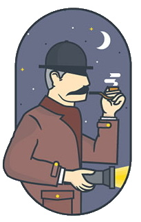

# Šerlokas - antrasis projektas

Šiame projekte panaudosime žemiau esantį paveiksliuką. CSS pagalba nustatysime dokumento elementų dydį ir išsidėstymą puslapyje.




*Projekte panaudosime garsiąją šerloko frazę:*
>Lorem ipsum dolor sit amet consectetur adipisicing elit. At sapiente dignissimos ipsum aspernatur consectetur neque!


*Šiame projekte bus panaudoti komandos:*

```
npm init -y
npm i -D live-server
npm run dev
...
```

